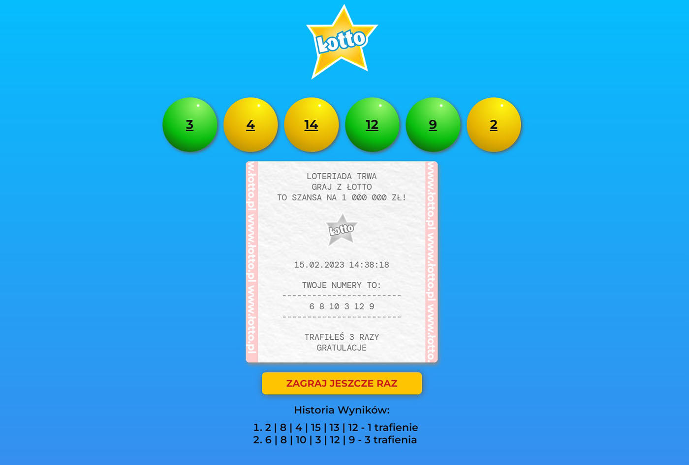

<a id="readme-top"></a>

<br />
<div align="center">
    

<h2 align="center">Simple Lottery App</h2>
<p>I present a very simple project in pure JavaScript, SASS and HTML.
The project was created to practice learning JavaScript.
Open the project, bet on 6 numbers and enjoy the winnings. This simple game will show you the numbers drawn and a receipt with your score. Your results are recorded in the history.
Don't fall into the trap ;)</p>

  <p align="center">
    <a href="https://simplelottery.netlify.app/">View Demo</a>
    ·
    <a href="https://github.com/AndrzejPuczko/LotteryGame/issues">Report Bug</a>
  </p>
</div>





<p align="right">(<a href="#readme-top">back to top</a>)</p>

### Installation
If you really want to edit this app just:

1. Clone the repo
   ```sh
   git clone https://github.com/AndrzejPuczko/LotteryGame.git
   ```
2. Install NPM packages
   ```sh
   npm install
   ```
3. Run the development server
   ```sh
   npm run dev
   ```

<p align="right">(<a href="#readme-top">back to top</a>)</p>

## Contact

Andrzej Puczko - [puczko.andrzej@gmail.com](mailto:puczko.andrzej@gmail.com)

Project Link: [https://simplelottery.netlify.app](https://simplelottery.netlify.app/)

<p align="right">(<a href="#readme-top">back to top</a>)</p>